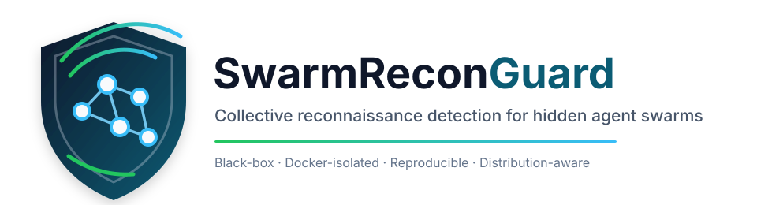

<p align="center">
  
</p>

<p align="center">
  <strong>A reproducible black-box research framework for detecting distributed semantic reconnaissance by individually low-risk agent populations.</strong>
</p>

<p align="center">
  <a href="https://github.com/vtavakkoli/swarm-recon-guard/actions/workflows/ci.yml"></a>
  <a href="LICENSE"></a>
  
  
  
</p>

<p align="center">
  <strong>Vahid Tavakkoli</strong> ·
  <strong>Kabeh Mohsenzadegan</strong> ·
  <strong><a href="https://www.google.com/goto?url=CAESZQHrOzAVj_qQh27OtDuU4ZqEZxs9T08MhWJS-5QOn88ZSCUCgqGjN_vJ-sacg7w5htkcX0MeFqdEZqCT-DXntesv6Ji9WF_6f74WZlR3NcxvpBB1bWuIPvVKV0J2OSKKQLnDHKNB">Kyamakya Kyandoghere</a></strong>
</p>

---

## Overview

**SwarmReconGuard** studies a security problem that conventional per-client defenses can miss:

> What if every individual agent sends valid, low-rate, policy-compliant requests, but the population collectively reconstructs a service's observable state or discovers information weaknesses?

The framework treats the defender as a **black-box boundary observer**. The detector sees service-side telemetry only. It does **not** see agent prompts, hidden coordination, internal memory, objectives, model activations, or true swarm membership.

The central hypothesis is:

[
R(A_i) < 	au_i quad orall i
]

while the collective process can still produce:

[
R(A_1,ldots,A_N) > 	au
]

SwarmReconGuard therefore evaluates **collective behavior**, not only individual request rates.

## Why this is different from DDoS

A distributed reconnaissance swarm does not need to make a service unavailable. Availability can remain normal while the population systematically increases its knowledge of the service.

The benchmark therefore separates three concerns:

- **availability** — latency, throughput, errors, SLA impact;
- **collective information acquisition** — semantic coverage and vulnerability discovery;
- **detection quality** — heuristic, distributional, and hybrid detectors.

The goal is not merely to classify traffic after the fact, but to eventually detect harmful collective exploration **before substantial information exposure**.

## Key capabilities

| Capability | Included |
|---|---|
| Docker-isolated synthetic service | Yes |
| 10 / 100 / 1,000 / 10,000 virtual agents | Yes |
| Matched-budget benign and reconnaissance scenarios | Yes |
| Per-identity baseline detector | Yes |
| Collective semantic-risk detector | Yes |
| Gaussian out-of-distribution detector | Yes |
| Gaussian likelihood-ratio detector | Yes |
| Hybrid heuristic + statistical detector | Yes |
| Leave-repeat-out validation | Yes |
| Leave-scale-out validation | Yes |
| Mean, SD, 95% CI, Wilson CI, Hedges' g | Yes |
| Gaussian assumption diagnostics | Yes |
| Self-contained HTML report | Yes |
| CSV / JSONL publication artifacts | Yes |
| Public Internet scanning | **No — intentionally blocked** |

## Architecture

```text
                       hidden attacker side

       virtual agents ───── optional coordination policy
             │
             │ ordinary low-rate HTTP GET requests
             ▼
╔════════════════════════ defender boundary ═══════════════════════╗
║                                                                  ║
║    ┌─────────┐        ┌────────────────────────────┐              ║
║    │ gateway │ ─────► │ synthetic municipal API    │              ║
║    └────┬────┘        └────────────────────────────┘              ║
║         │                                                        ║
║         ▼                                                        ║
║   Redis telemetry                                                ║
║         │                                                        ║
║         ├────────► transparent collective-risk detector          ║
║         │                                                        ║
║         └────────► statistical / distributional analysis        ║
║                                                                  ║
╚══════════════════════════════════════════════════════════════════╝
             │
             ▼
       experiment evaluator
             │
             ▼
 CSV · JSONL · statistics · HTML report
```

The defender observes gateway telemetry such as endpoint family, semantic resource key, response status, latency, body size, diagnostic access, and synthetic identity. Hidden swarm coordination remains outside the defender's view.

## Experimental scenarios

SwarmReconGuard v0.2 contains three controlled traffic regimes using matched per-agent request budgets.

| Scenario | Coordination | Behavior |
|---|---|---|
| `benign_flash` | None | High-volume legitimate traffic with locality, repetition, and hot resources |
| `independent_recon` | None | Independent exploratory agents sampling the full synthetic service namespace |
| `coordinated_swarm` | Yes | Agents partition the namespace to reduce duplicate work and maximize collective coverage |

The default publication-oriented matrix evaluates:

[
3	ext{ scenarios} 	imes 4	ext{ population sizes} 	imes 10	ext{ repeats}=120	ext{ runs}
]

with population sizes:

[
N in {10,100,1000,10000}.
]

> **Implementation note:** 10,000 agents means 10,000 distinct virtual identities and policy instances. They are executed as bounded asynchronous workers rather than 10,000 Docker containers.

## Synthetic information weaknesses

The target service contains only harmless, measurable benchmark channels:

| ID | Synthetic weakness | Purpose |
|---|---|---|
| V001 | Sequential ticket enumeration | Measures systematic identifier-space exploration |
| V002 | Permit prefix oracle | Measures population-wide aggregate probing |
| V003 | Diagnostic metadata disclosure | Measures unnecessary information exposure |

A successful experiment records discovery of these synthetic conditions. No shell execution, malware behavior, or host exploitation is included.

## Detection stack

### 1. Transparent collective-risk detector

The original detector uses interpretable population-level features:

- semantic novelty ratio;
- normalized namespace span;
- gap regularity;
- diagnostic-access ratio;
- endpoint-family entropy;
- collective semantic coverage pressure.

The baseline score is:

[
R_h =
0.18N + 0.22S + 0.20G + 0.15D + 0.15H + 0.10C.
]

This detector is intentionally simple and auditable.

### 2. Gaussian out-of-distribution detector

A benign training fold is represented by a regularized multivariate Gaussian after logit-transforming bounded features:

[
H_0:mathbf{x}simmathcal{N}(oldsymbol{mu}_0,oldsymbol{Sigma}_0).
]

The anomaly score is squared Mahalanobis distance:

[
D_M^2(mathbf{x})=
(mathbf{x}-oldsymbol{mu}_0)^T
oldsymbol{Sigma}_0^{-1}
(mathbf{x}-oldsymbol{mu}_0).
]

This answers:

> Is the collective behavior statistically inconsistent with the learned benign distribution?

### 3. Gaussian likelihood-ratio detector

Known reconnaissance regimes are represented as a scenario-conditioned Gaussian mixture:

[
p_A(mathbf{x})=
sum_k pi_k
mathcal{N}(mathbf{x};oldsymbol{mu}_k,oldsymbol{Sigma}_k).
]

The score is:

[
Lambda(mathbf{x})=
log p_A(mathbf{x})-log p_B(mathbf{x}).
]

This answers:

> Is the observation better explained by a known reconnaissance distribution than by benign activity?

### 4. Hybrid detector

The statistical and transparent views are combined without discarding interpretability:

[
R_{hybrid}
=
w,z(R_h)+(1-w),z(Lambda),
]

with `w = 0.5` by default.

All standardization and thresholds are estimated from training folds only.

## Cross-validated evaluation

The statistical layer is evaluated out-of-fold using two validation modes.

### Leave-repeat-out

One experimental repetition is held out at a time. This tests robustness to run-to-run variation.

### Leave-scale-out

One entire population size is held out:

[
N_{test}
otin N_{train}.
]

For example:

[
N_{train}={10,100,1000},
qquad
N_{test}=10000.
]

This is intentionally difficult and tests generalization to an unseen swarm scale.

The framework reports both fold-level and macro-averaged AUROC/AP so scores produced by independently fitted folds are not assumed to be perfectly calibrated across folds.

## Gaussian assumption diagnostics

SwarmReconGuard does **not** assume that benign traffic is truly Gaussian.

Each report evaluates the approximation with:

- Shapiro-Wilk tests for transformed individual features;
- Mardia multivariate skewness;
- Mardia multivariate kurtosis.

If normality is rejected, the Gaussian model remains an interpretable statistical baseline rather than a claimed law of traffic behavior.

## Core metrics

The benchmark records both security and service outcomes.

### Security

- collective semantic coverage;
- vulnerability discovery rate;
- detector peak and final scores;
- positive detection rate;
- false-positive rate;
- AUROC and average precision;
- time-to-detection;
- **Exposure Before Detection (EBD)**;
- per-identity baseline trigger rate;
- likelihood-ratio and OOD scores;
- fold-level and macro cross-validation metrics.

Exposure Before Detection is:

[
EBD=C(t_{alarm}),
]

where (C(t)) is the fraction of the synthetic observable state learned by time (t).

### Service quality

- request count and throughput;
- p50 / p95 / p99 client latency;
- HTTP status distribution;
- transport error rate;
- SLA delta relative to matched benign traffic.

### Statistical reporting

Repeated cells report:

- arithmetic mean;
- sample standard deviation;
- two-sided 95% Student-(t) confidence interval;
- Wilson confidence intervals for detection proportions;
- Hedges' (g) effect size.

## Quick start

### Requirements

- Docker Engine
- Docker Compose v2
- Git

Clone:

```bash
git clone https://github.com/vtavakkoli/swarm-recon-guard.git
cd swarm-recon-guard
```

Run the CI-sized validation suite:

```bash
docker compose run --rm experiment run   --suite /app/scenarios/smoke.yaml
```

Run the pilot suite:

```bash
docker compose run --rm experiment run   --suite /app/scenarios/pilot.yaml
```

Run the full publication-oriented matrix:

```bash
docker compose run --rm experiment run   --suite /app/scenarios/publication.yaml
```

## Generate a custom experiment

```bash
docker compose run --rm experiment generate   --output /app/results/custom-suite.yaml   --agents 10,100,1000,10000   --scenarios benign_flash,independent_recon,coordinated_swarm   --repeats 10   --requests-per-agent 3   --concurrency 512   --seed 20261005   --alpha 0.01   --shrinkage 0.10   --hybrid-weight 0.50
```

Then run it:

```bash
docker compose run --rm experiment run   --suite /app/results/custom-suite.yaml
```

## Rebuild a report from an existing experiment

```bash
docker compose run --rm experiment report   --run-dir /app/results/<experiment-folder>
```

This is useful when analysis or report-generation logic changes but the underlying experiment traces do not need to be regenerated.

## Result artifacts

Each run suite creates:

```text
results/<suite>-<timestamp>/
├── manifest.json
├── runs.jsonl
├── raw_metrics.csv
├── summary.csv
├── classification.json
├── classification_by_agents.csv
├── effect_sizes.csv
├── distributional_scores.csv
├── distributional_folds.csv
├── distributional_summary.csv
├── gaussian_diagnostics.json
└── report.html
```

`report.html` is self-contained and can be opened locally without an external dashboard.

## Reproducibility profiles

| Suite | Agents | Repeats | Intended use |
|---|---:|---:|---|
| `smoke.yaml` | 10, 30 | 3 | CI and statistical sanity check |
| `pilot.yaml` | 10, 100, 1,000 | 3 | Fast local evaluation |
| `publication.yaml` | 10, 100, 1,000, 10,000 | 10 | Repeated publication-oriented study |

For manuscript experiments, record host hardware, operating system, Docker version, available CPU/memory, and background workload because absolute throughput and latency are host dependent.

## Safety boundary

SwarmReconGuard is intentionally constrained to its synthetic Docker environment.

The default deployment:

- uses an `internal: true` Docker network;
- exposes no target service port to the public Internet;
- does not mount the Docker socket;
- does not mount host credentials;
- drops Linux capabilities;
- uses `no-new-privileges`;
- rejects arbitrary non-lab gateway hosts in the experiment runner.

The project is a research benchmark, **not** a general-purpose vulnerability scanner.

See [SECURITY.md](SECURITY.md) and [docs/threat-model.md](docs/threat-model.md).

## Repository structure

```text
swarm-recon-guard/
├── docker-compose.yml
├── scenarios/
│   ├── smoke.yaml
│   ├── pilot.yaml
│   └── publication.yaml
├── src/swarmguard/
│   ├── target/        # synthetic municipal-style service
│   ├── gateway/       # defender-visible telemetry boundary
│   ├── detector/      # online collective-risk detector
│   ├── experiment/    # virtual agents and experiment runner
│   └── reporting/     # statistics, distributional models, HTML report
├── docs/
│   ├── assets/
│   ├── methodology.md
│   └── threat-model.md
├── tests/
└── results/
```

## Research roadmap

The current framework is a controlled baseline. Natural extensions include:

- scale-conditioned benign distributions;
- benign Gaussian mixtures and non-parametric density estimators;
- temporal CUSUM / sequential likelihood accumulation;
- camouflaged and low-and-slow swarms;
- adaptive evasion policies;
- gossip and blackboard coordination topologies;
- service-capacity-aware security experiments;
- multiple independently implemented synthetic services;
- constrained LLM/planner agents;
- temporal interaction-graph detectors;
- detector ablation and threshold-sensitivity studies.

A central future objective is to achieve high detection while simultaneously minimizing:

[
EBD,quad FPR,quad Delta SLA.
]

## Development

Install locally:

```bash
python -m pip install -e '.[dev]'
pytest
```

Or run:

```bash
make test
make smoke
```

CI executes both unit tests and a Docker Compose end-to-end smoke experiment.

## Methodology

For the full experimental and statistical specification, see:

- [Methodology](docs/methodology.md)
- [Threat model](docs/threat-model.md)

## Authors

- **Vahid Tavakkoli**
- **Kabeh Mohsenzadegan**
- **[Kyamakya Kyandoghere](https://www.google.com/goto?url=CAESZQHrOzAVj_qQh27OtDuU4ZqEZxs9T08MhWJS-5QOn88ZSCUCgqGjN_vJ-sacg7w5htkcX0MeFqdEZqCT-DXntesv6Ji9WF_6f74WZlR3NcxvpBB1bWuIPvVKV0J2OSKKQLnDHKNB)**

## Citation

If you use SwarmReconGuard in academic work, please cite the software metadata in [CITATION.cff](CITATION.cff). A publication citation can be added once a manuscript is publicly available.

## License

Licensed under the [Apache License 2.0](LICENSE).

---

<p align="center">
  <strong>SwarmReconGuard</strong><br>
  Detect collective reconnaissance even when individual agents remain in the green zone.
</p>
